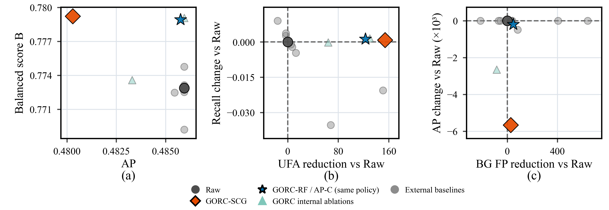

# GORC Open-Set Reliability Calibration

Research code, data and figures for **Lightweight Open-Set Reliability Calibration for Frozen Open-Vocabulary Object Detectors**.

Geometry-aware Open-Set Reliability Calibration (GORC) learns an acceptance layer from a frozen detector's boxes, labels, confidence scores and image sizes. It combines a class-conditioned reliability ranker with calibration-selected score policies and thresholds.

**Version: 2026-10-06.** This version replaces the initial release with the current evaluation rules, complete cached inputs, fitted models, numerical results and manuscript figures. Earlier contents remain in Git history; earlier Markdown documentation is preserved in [docs/history](docs/history/README.md).

## Main result

On the primary COCO test split with YOLO-World-l, GORC-RF reduces accepted annotated unknown objects from **299 to 176 (41.1%)**, while increasing the balanced reliability score B from **0.7729 to 0.7789**.

| Policy | B | Known precision | Known recall | UFA | BG FP | Full-list AP |
|---|---:|---:|---:|---:|---:|---:|
| Raw global threshold | 0.7729 | 0.7384 | 0.6638 | 299 | 2875 | 0.4859 |
| GORC-SCG | 0.7792 | 0.7488 | 0.6646 | 145 | 2848 | 0.4803 |
| GORC-RF / AP-C | 0.7789 | 0.7487 | 0.6650 | 176 | 2828 | 0.4858 |

UFA counts annotated unknown **objects**; BG FP counts accepted **detections**. B is the harmonic mean of known precision, known recall and unknown rejection. Full-list AP is evaluated before acceptance thresholding. RF and AP-C select the same primary policy. [Online Resource 1](docs/Online_Resource_1.pdf) gives uncertainty, matched baselines and the wider experiments.



## Get started

```bash
git clone https://github.com/wohaoniubia/gorc-open-set-reliability-calibration.git
cd gorc-open-set-reliability-calibration
python -m pip install -r requirements.txt
python scripts/validate_release.py
python code/portable_cli.py smoke --dataset coco_yolo --out run_outputs/smoke
python code/portable_cli.py replay --dataset coco_yolo --out run_outputs/replay
```

Use **Python 3.11** in a fresh environment. The checkout contains approximately 900 MB of data and models. Cached-output reproduction needs neither original photographs nor detector checkpoints. `replay` reconstructs selected scores from fitted models and checks all six primary method rows on calibration and test images against archived results.

To refit the fixed method and select policies using calibration images only:

```bash
python code/portable_cli.py refit --dataset coco_yolo --out run_outputs/refit
```

Available streams: `coco_yolo`, `coco_gdino`, `lvis_yolo`, `original20`, `voc20`, `random20_seed611`, `random20_seed612`, `random20_seed613`. The original primary COCO cache and the separately inferred `original20` control remain separate because their floating-point outputs differ slightly.

## Repository guide

| Location | Contents |
|---|---|
| [code](code/) | Portable loading, fitting, policy selection, evaluation, coefficient folding, runtime and supplementary diagnostics |
| [data](data/) | Candidate boxes/scores, known/unknown annotations, class maps and complete image splits for eight streams |
| [artifacts](artifacts/) | Fitted models, readable coefficients, priors, frozen selected scores and reference metrics |
| [config](config/) | Stream configuration, fixed family/C decision and detector/vocabulary settings |
| [source_data](source_data/) | Detailed experiments, numerical figure inputs, author ratings and crowd diagnostic |
| [figures](figures/README.md) | Nine figures extracted from the latest manuscript, with captions, crop provenance and checksums |
| [Result index](docs/RESULTS_INDEX.md) | Figures and Tables 1–7 / S1–S23 mapped to source files |
| [Data guide](docs/DATA_GUIDE.md) | Schemas, counting units and provenance |
| [Reproduction guide](docs/REPRODUCIBILITY.md) | Detailed commands and experiment scope |
| [verification](verification/) | Archived verification and checks run for this publication |
| [MANIFEST.json](MANIFEST.json) | Current file checksums and byte sizes |

Main and supplementary tables are also provided as CSV files extracted from the manuscript and ESM. They preserve displayed precision; use the numerical experiment files for computation.

## Additional analyses

```bash
python code/portable_cli.py verify-online --dataset coco_yolo --out run_outputs/online_check
python code/benchmark_cli.py --dataset coco_yolo --out run_outputs/benchmark
python code/reassessment_cli.py --out run_outputs/reassessment
python code/manual_review_summary.py
python code/round5_crowd_review.py --out run_outputs/crowd_review
```

The reassessment command covers the score-only baseline bridge, RF versus per-class thresholds, LVIS support and the nested AP comparison. The crowd command reproduces the bounding-box overlap and recorded-name diagnostic. Other supplementary experiments have archived results and settings; replay does not rerun every bootstrap or detector-inference experiment.

## Sources and reuse

COCO/LVIS annotations, processed detector outputs and derived results are included. Original dataset photographs and pretrained detector checkpoints are obtained from their providers; figure files include the manuscript examples. See [third-party sources and terms](THIRD_PARTY_NOTICES.md).

The existing licensing status is retained: the authors have not specified a separate reuse license for project-authored code and materials. No new terms are assigned to third-party assets. For citation, include this repository URL and the commit used; paper publication details can be added when available.
