
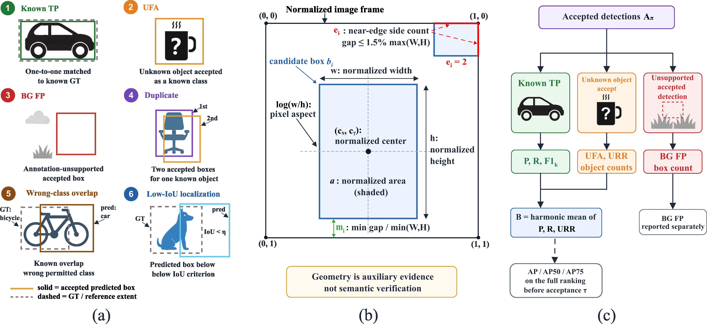
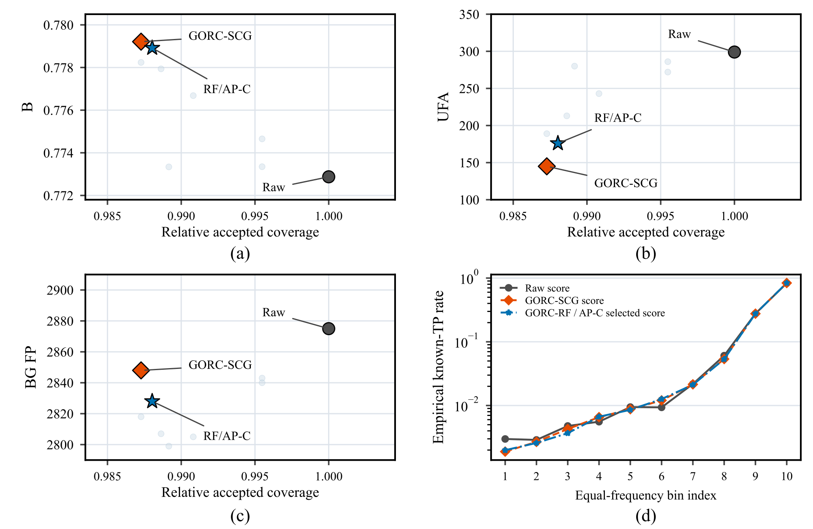
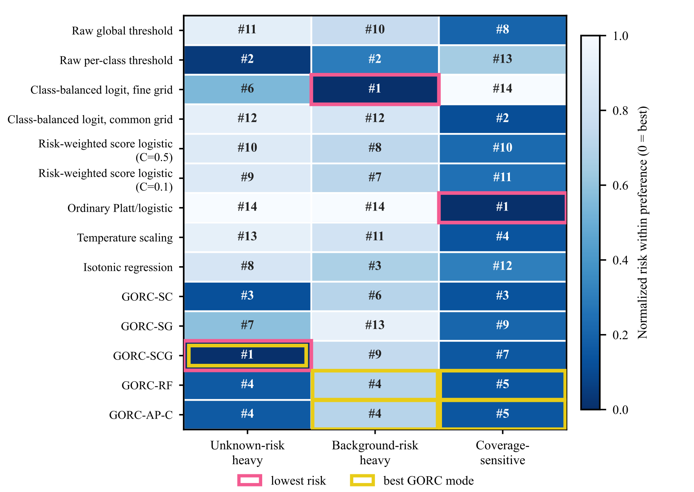
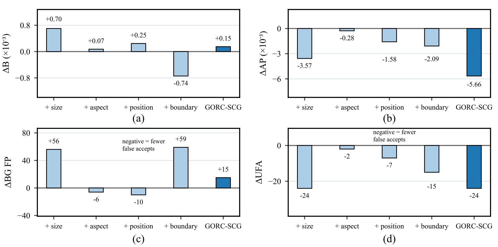
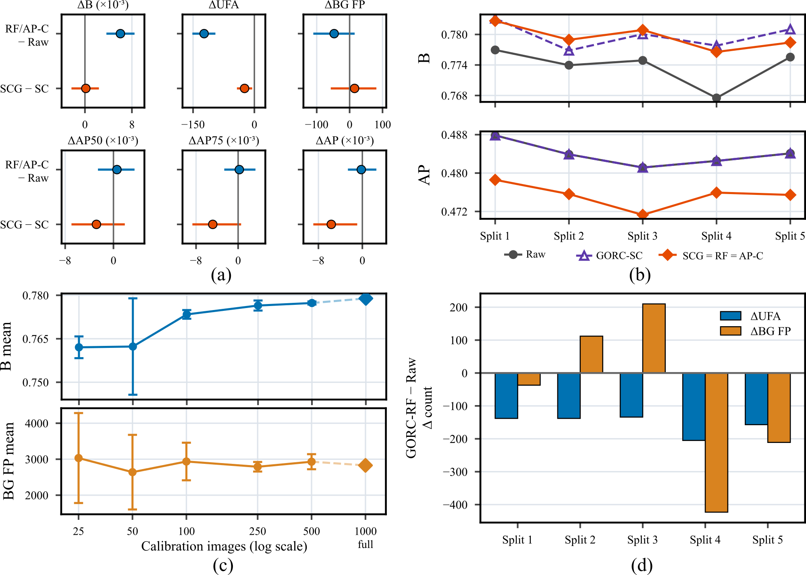
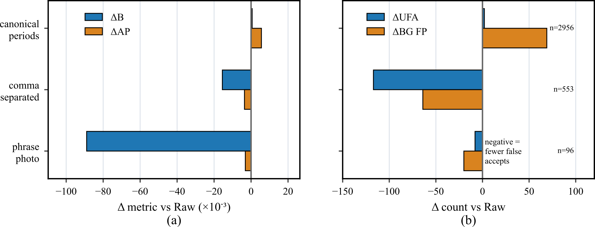
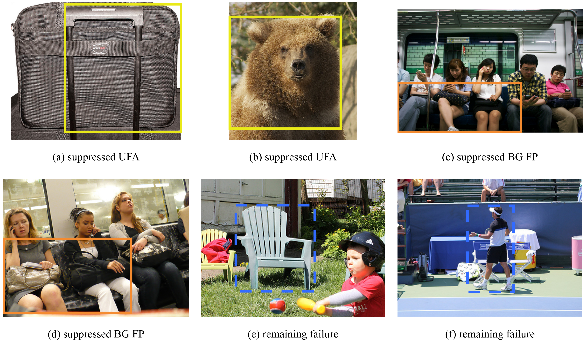

# Figures extracted from the manuscript

These are the nine figures embedded in the 2026-10-06 manuscript. Native pixels are preserved. For Figures 4, 5 and 6, the crop recorded in Word is applied without resizing or retouching; their original embedded files are also retained in `embedded/`. `manifest.json` records the source document checksum, captions, drawing sizes, crop rectangles and image checksums.

## Figure 1

Fig. 1. GORC output-side reliability calibration workflow for frozen open-vocabulary detectors: frozen detector query, fixed candidate stream, SCG feature construction, reliability ranking, calibrated acceptance, and operating-mode selection.

## Figure 2

Fig. 2. Detection-level accepted-output taxonomy, geometry cues, and reliability metrics. (a) Candidate-output taxonomy. (b) Normalized box geometry. (c) Accepted-set metrics.

## Figure 3

Fig. 3. COCO operating-point trade-offs across baselines, GORC ablations, and GORC modes. (a) AP-B landscape. (b) UFA-recall trade-off. (c) BG FP-AP trade-off. RF and AP-C select the same policy, so they share one marker.

## Figure 4

Fig. 4. COCO risk-coverage and score-bin diagnostics. (a–c) Zoomed operating regions for B, UFA and BG FP; the full grid is included in Online Resource 2. (d) Score-bin known-TP rate. RF and AP-C select the same score and are shown once.

## Figure 5

Fig. 5. Preference-sensitive rankings for the plotted policies. The two score-only logistic rows use raw score, score logit and risk weighting, with C=0.5 or C=0.1. RF and AP-C select the same policy.

## Figure 6

Fig. 6. Effect of adding each geometry group to the matched score-class (SC) model on the primary COCO stream. (a) Change in B and (b) change in AP, both in units of 10⁻³; (c) change in BG FP and (d) change in UFA, in counts. Negative values in (c) and (d) mean fewer false accepts. Each group is added together with its class interactions, and GORC-SCG uses all four groups. Values are listed in Table S8, and intervals for GORC-SCG are given in Table S6.

## Figure 7

Fig. 7. Fixed-policy uncertainty and calibration dependence. (a) Paired image-bootstrap 95% intervals with frozen policies: RF/AP-C minus Raw, and SCG minus SC. (b) Five refit/reselection partitions (seeds 101, 202, 303, 404 and 505). SCG, RF and AP-C selected the same direct-score policy in every partition and are drawn as one line; SC keeps the within-class ranking, so its AP equals Raw. (c) Fixed-configuration calibration budgets; error bars show the SD over three subsets, while the full-budget point is one fit. (d) Change in UFA and BG FP for GORC-RF relative to Raw in each partition.

## Figure 8

Fig. 8. Grounding DINO prompt-format diagnostics on 100 calibration and 300 test images. Each candidate stream is recalibrated separately. Counts and Raw performance differ across prompt formats, including low-recall cases.

## Figure 9

Fig. 9. Final-policy accepted-output examples from the evaluated public protocols. Suppressed unknown-object examples are checked at the object level; annotation-unsupported examples use the stated IoU rule. Retained failures are shown separately. Solid boxes indicate suppressed detections and dashed boxes retained errors.

